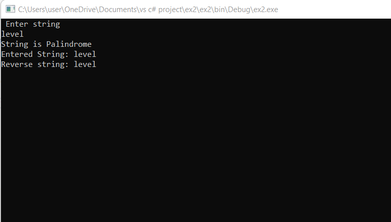
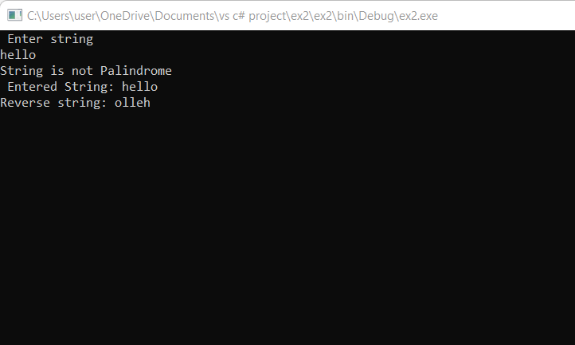

# Palindrome


## Aim:
To write a C# program to find whether the given string is a Palindrome or not.
## Algorithm:

## Program:
```
using System;
namespace palindrome
{
    class Program
    {
        static void Main(string[] args)
        {
            string s, revs = "";
            Console.WriteLine(" Enter string");
            s = Console.ReadLine();
            for (int i = s.Length - 1; i >= 0; i--)  
            {
                revs += s[i].ToString();
            }
            if (revs == s) 
            {
                Console.WriteLine("String is Palindrome \nEntered String: {0}\nReverse string: {1}", s, revs);
            }
            else
            {
                Console.WriteLine("String is not Palindrome \n Entered String: {0}\nReverse string: {1}", s, revs);
            }
            Console.ReadKey();
        }
    }
}
```

## Output:



## Result:
Thus the C# program to display whether the given string is Palindrome or not is executed successfully.
